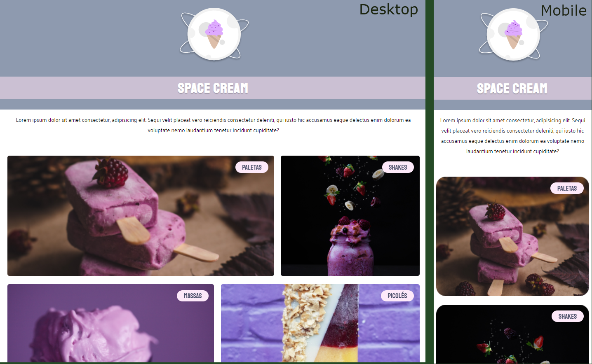

# Desafio: Mobile first

Projeto construído a partir do Programa Explorer / Stage 03 / Mobile first.  
Foi disponibilizado um link no <strong>Figma</strong> onde nosso objetivo era replicar o projeto, utilizando os métodos aprendidos nas aulas sobre responsividade.
 

Link do desafio:  https://efficient-sloth-d85.notion.site/Mobile-first-3355d7df0aa24efcb4287f69b3859928

Link do projeto: jonatank28.github.io/Criando-formul-rios/

## ⚙️ Tecnologias utilizadas

- HTML 
- CSS  
- Figma
- Git e Github

## 🧾 Contato

Email: jonatankalmeidakk28@gmail.com  
WhatsApp: (49) 9 8435-6670

## 🤓 Considerações

Muito aprendizado referente a responsividade, utilização de variáveis para cores, fontes e medidas, fontes relativas, etc...